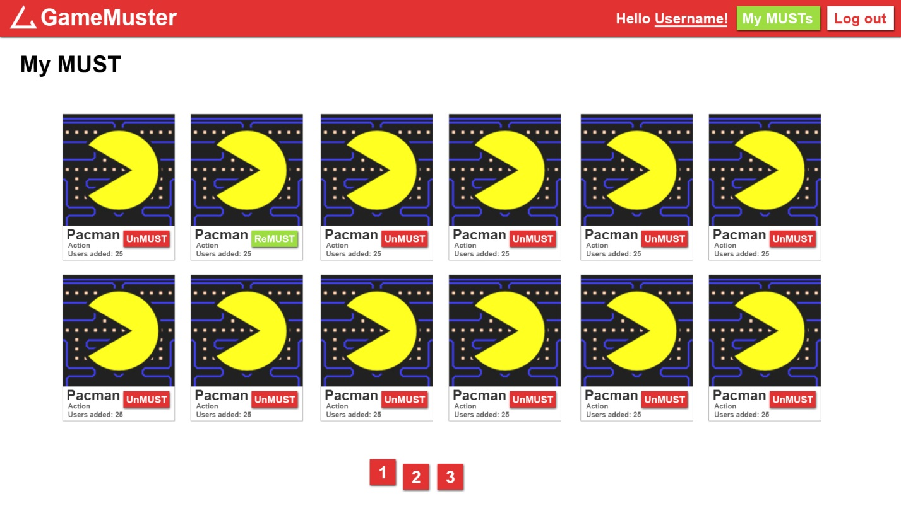

# Create favorite games page

## Short Description

Create Must(Favourite) page with ability to add/remove favorite games per user

## Estimation (h)

32

## Topics

* Python/Django

## Requirements

* Create user&#39;s favorite games page
* Realize soft delete feature when user removes the game from his &quot;musts&quot;
* Deploy your app to Heroku using any wsgi server

## Must page

