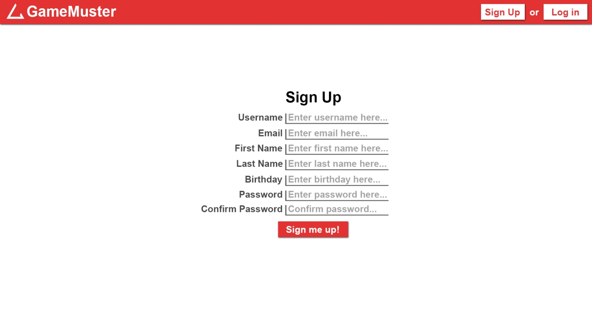
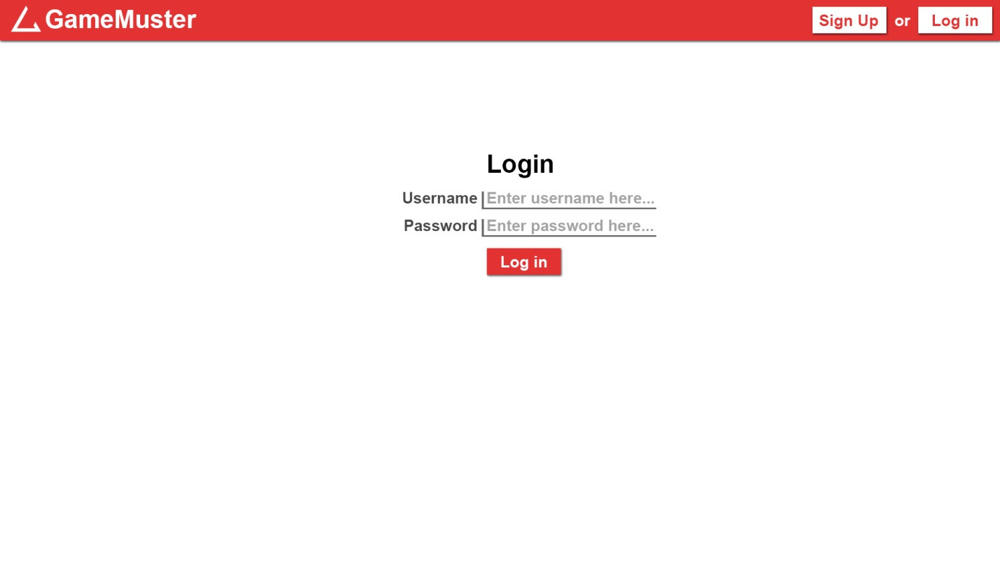
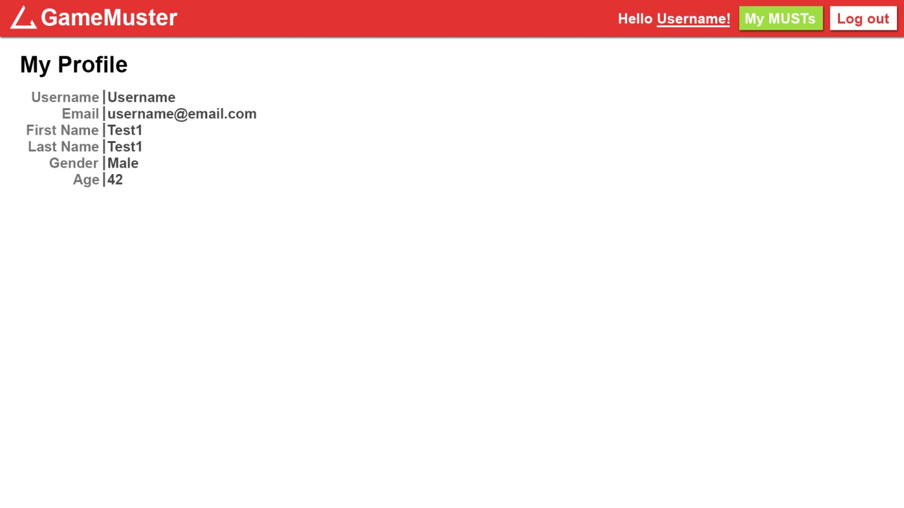

# Create Sing up, Login, User profile

## Short Description

Create user model. After that - create Sign Up, Log In, User profile pages.

## Estimation (h)

32

## Topics

* Python/Django
* PostgreSQL

## Requirements

* Use PostgreSQL
* Use any free email-sending service to send confirmation emails to users when signing up. *(optional, bonus)*

## Sign Up page

## Log In page

## Profile page

